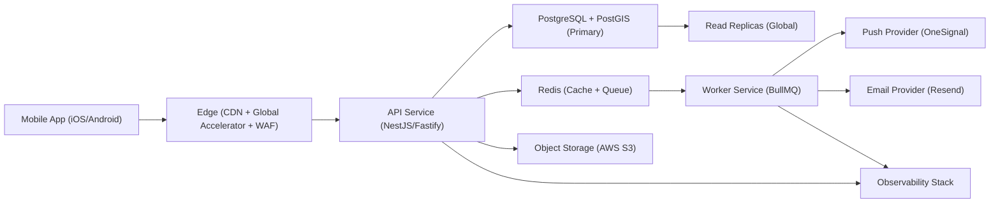

# Arquitectura base del MVP

- Estado: `Aprobado`
- Version: `1.1`
- Ultima actualizacion: `2026-02-24`
- Producto: `Que hay pa' hacer`
- Ciudad piloto: `Bogota, Colombia`
- Enfoque de plataforma: `Mobile-first (iOS/Android)`

## 1. Objetivo arquitectonico

Definir una arquitectura cerrada, escalable y operable para lanzar el MVP mobile sin decisiones tecnicas abiertas, dejando base de crecimiento global.

## 2. Estilo arquitectonico

- Patron principal: `Monolito modular`.
- Repositorio: `Monorepo`.
- Integracion entre modulos: `API REST versionada + eventos de dominio`.
- Enfoque cliente: `Mobile-first`.
- Escalado inicial: `separacion de procesos (mobile/api/worker) + edge global`.

## 3. Componentes del sistema (MVP)

1. `Mobile App` (iOS y Android) para usuarios y modo organizador.
2. `Edge Layer` (CDN + aceleracion global + WAF).
3. `API Service` para logica de negocio.
4. `Worker Service` para jobs asincronos (recordatorios, limpieza, reconciliacion).
5. `PostgreSQL + PostGIS` para datos transaccionales y geoespaciales.
6. `Redis` para cola, cache y control de rate-limits.
7. `AWS S3` para posters e imagenes.
8. `Proveedor de notificaciones` para push y email transaccional.
9. `Remote Config/Feature Flags` para activar funciones gradualmente.

## 4. Diagrama de arquitectura (alto nivel)

## 5. Contextos funcionales (bounded contexts)

1. `Identity`: autenticacion, sesiones, perfiles.
2. `Catalog`: eventos, venues, categorias, multimedia.
3. `Discovery`: feed, filtros, ranking, mapa.
4. `Organizer`: publicacion, borradores, estado y ediciones.
5. `Engagement`: guardados, follows, alertas.
6. `Moderation`: reportes, sanciones, calidad de contenido.
7. `Analytics`: tracking de eventos, embudos y cohortes.
8. `Personalization`: avatar, skins, preferencias visuales y assets futuros.

## 6. Flujos tecnicos criticos

1. Descubrimiento: app mobile solicita feed -> API aplica ranking -> respuesta paginada.
2. Publicacion: organizador crea evento -> validacion -> estado `published` -> indexacion geoespacial.
3. Recordatorio: evento guardado -> job en cola -> worker envia push 24h/2h.
4. Moderacion: usuario reporta evento -> cola de revision -> accion y auditoria.
5. Personalizacion futura: cliente solicita perfil visual -> API retorna configuracion por feature flags.

## 7. Reglas no negociables de arquitectura

1. Ningun modulo accede a BD de otro modulo sin pasar por capa de dominio.
2. Toda operacion externa se encapsula en adaptadores (storage, push, email, mapas).
3. Todo endpoint nuevo debe documentarse en OpenAPI antes de merge.
4. Todo cambio de esquema requiere migracion versionada.
5. Toda tarea tecnica requiere ID y criterio de aceptacion.
6. Toda funcionalidad futura se activa por feature flags para despliegue gradual.

## 8. Lineamientos de escalabilidad global

1. Arquitectura region-aware desde MVP con `country_code`, `city_id` y `timezone` en datos clave.
2. API stateless para escalar horizontalmente por region.
3. Datos pesados de media siempre servidos desde CDN.
4. Lecturas globales via replicas y cache regional.
5. Estrategia detallada en `28_escalabilidad_global.md`.

## 9. Objetivos de calidad tecnica (SLO)

- API p95 lectura: `<= 300ms` en region primaria.
- API p95 escritura: `<= 450ms` en region primaria.
- API p95 lectura global: `<= 500ms`.
- Error rate 5xx diario: `< 1%`.
- Disponibilidad mensual MVP: `>= 99.5%`.
- Freshness de catalogo: eventos publicados visibles en feed en `< 60s`.

## 10. Estrategia de evolucion

- Fase MVP: monolito modular + mobile app unica.
- Fase crecimiento: separar `Discovery` y `Notifications` a servicios dedicados.
- Regla de extraccion: extraer modulo si durante 2 semanas consecutivas se incumple algun SLO por causa atribuida al modulo.
